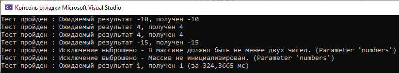

# Тестовое задание на вакансию Junior C# developer в Монополия
Исходный код программы находится в [-/Test Task/Program.cs](https://github.com/punkmyduck/-/blob/main/Test%20Task/Program.cs)

В программе содержатся следующие элементы:
- interface IMinTwoSumCalculator : интерфейс с объявлением метода для поиска суммы;
- class StandardMinTwoSumCalculator : класс, реализующий интерфейс;
- class MinTwoSumCalculatorTest : класс с тестами реализованного метода.

Реализованы следующие тесты в классе MinTwoSumCalculatorTest:
- Test_CorrectSum : базовый тест с проверкой на предложенных данных;
- Test_TwoElementsSum : тест на массиве из двух элементов;
- Test_DuplicateMinimums : тест на массиве с повторяющимися элементами;
- Test_NegativeNumbers : тест на массиве только из отрицательных элементов;
- Test_LargeArray : тест на массиве из 100.000.000 элементов;
- Test_LessThanTwoElements : тест на массиве из одного элемента, проверка на корректное выбрасывание исключения;
- Test_UnitializedArray : тест на неинициализированном массиве, проверка на корректное выбрасывание исключения.

Результаты проведения тестов:

